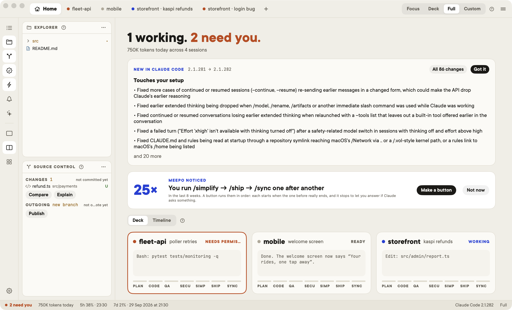
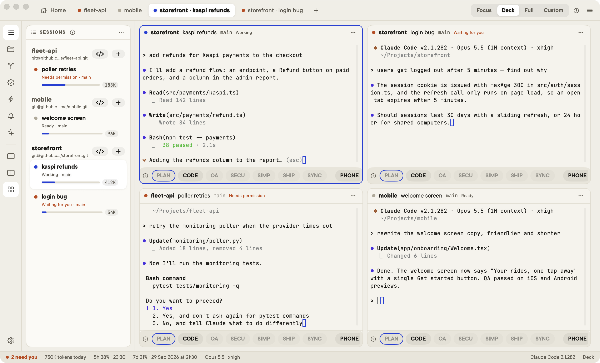
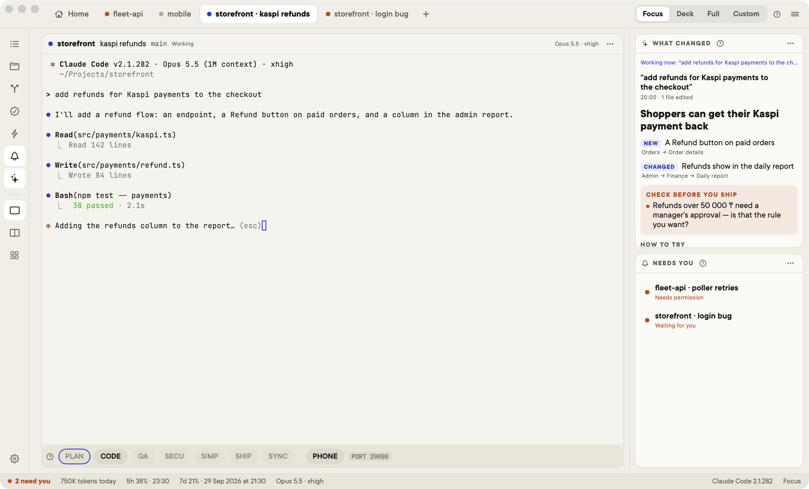
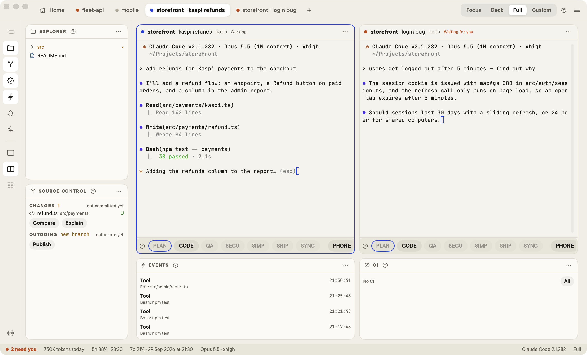

# Meepo

> A comfortable home for Claude Code on your Mac.

[Claude Code](https://claude.com/claude-code) is a great way to build software. Meepo makes it easier to live with every day: all your Claude Code sessions in one window, a glance at which one is working and which one waits for you, and what changed — in your product's terms, not just in the code.

Meepo doesn't write code and isn't another agent. Claude Code does the work, with your own settings, skills and hooks; Meepo is the place around it.



## What it does

**Every session in one window.** Tabs for each Claude session across your projects, Home to see them all at once, up to four terminals side by side. Name sessions to tell two in the same project apart. `Ctrl+Tab` jumps to the session that needs you.



**What changed — in your product's terms.** Every request you give Claude is a run. One click asks the session that did the work to explain it for your users: what they will notice and where, what to check before shipping (money, accounts, anything it assumed), and how to try it. The code diff is still one click away.



**Your layout.** Focus (one terminal and what changed), Deck (four sessions), Full (Explorer, Source Control and two terminals, like VS Code) — or move any panel yourself. Point at an icon to see what it is; every panel has a **?**.



**Git like VS Code, teammates included.** CHANGES, INCOMING and OUTGOING per repo, Compare in VS Code's own editor (Monaco), Explain in plain words. Teammates' commits come in by themselves once your work is committed, and the agent is told what changed under it. Projects that hold several repos, and sessions that also work in a second project (`claude --add-dir`), show every repo.

**CI and deploys.** GitHub Actions and GitLab CI, step by step, with a Run button for the manual deploy step.

**Knows Claude Code.**
- Plan limits (5 hours, 7 days) with reset times, the real model and effort of each session, context as Claude Code counts it.
- *New in Claude Code*: after an update, the changes that touch your setup come first.
- *Claude Code Setup*: finds things that quietly work against you — an effort level that no longer reaches the model you use, hook timeouts written in milliseconds, allow rules like `Bash(sudo:*)`, skills that push which Claude may start by itself — each with a fix and an exact undo.

**Learns from how you work.** *Automations* shows your skills and commands with how often you really use them, effort and model per skill, and which ones Claude may start by itself. Meepo notices what you repeat — commands in a row, requests you keep typing — and offers a button or a personal skill for it. Then it checks whether it helped.

**Stages.** PLAN → CODE → QA → SECURITY → SIMPLIFY → SHIP → SYNC, each a click that runs your own command — or Claude Code's built-in one (`/verify`, `/security-review`, `/commit-push-pr`) when a project has none.

**For people new to Claude Code.** Onboarding installs and signs in Claude Code step by step and starts a first project. *Guided mode* makes Claude explain what it does and ask before anything risky — pushing, deleting folders, `sudo`, `.env` secrets.

## Built on Claude Code

Everything Meepo shows comes from Claude Code itself, and everything it does goes through it:

- the real `claude` CLI in each terminal, with your login, settings, skills, hooks and memory
- Claude Code's own hooks and statusline for what each session is doing, its plan limits and effort
- Claude Code's built-in commands and features where they exist — `/verify`, `/security-review`, `/commit-push-pr`, `/rewind`, worktrees, `--add-dir`, Remote Control, output styles, `skillOverrides`
- Claude Code's own changelog, to point out what a new release means for your setup

Meepo follows Claude Code as it grows: when Claude Code gains something, Meepo uses it rather than building its own.

## Install

macOS 14 or later. You need [Claude Code](https://docs.claude.com/en/docs/claude-code) and `git`; `gh` / `glab` for CI.

```bash
brew tap azamatfg/meepo
brew trust azamatfg/meepo     # newer Homebrew asks you to trust third-party taps once
brew install --cask meepo
```

`meepo` opens it from any terminal; `meepo .` adds the current folder with a session in it.

Meepo updates itself: new versions download in the background, and the status bar offers a restart (or it installs when you quit). `meepo update` checks right away. Updates install only if they are signed by the same developer and notarized by Apple.

Or download `Meepo.zip` from [Releases](https://github.com/Azamatfg/meepo/releases) and move `Meepo.app` to Applications.

### Try it without your projects

```bash
open -n -a Meepo --args --demo
```

Made-up projects, no `claude` started, nothing of yours read or written — for a look around, screenshots or a demo.

### Uninstall

Meepo menu → **Remove Hook Bridge** takes its hooks out of `~/.claude/settings.json`; then `brew uninstall --cask meepo` (add `--zap` to delete `~/.meepo`). If you skip the first step, the leftover hook entries do nothing.

## Your phone

Meepo is the control panel on your Mac. On your phone, use the Claude app through Claude Code's **Remote Control**: turn it on for new sessions in Settings, or press **PHONE** on a running one. From the phone you can see that a session is waiting, read the request and answer it.

## Privacy and safety

- Everything stays on your Mac: `~/.meepo/meepo.sqlite`, backups in `~/.meepo/backups`. No telemetry. A crash report is shown to you to copy, never sent.
- Meepo talks to Claude Code through hooks and a statusline, posted to a server on `127.0.0.1` only, with a local token.
- It stores no API keys or passwords; GitHub, GitLab and Claude use their own CLIs and logins.
- `claude -p` runs only when you click (Explain, drafts, release notes) and never with tools or your hooks.
- Push, pull and deploy happen on your click with a confirmation; Meepo never force-pushes. Quitting while an agent works asks first.
- Every change Meepo makes to your files is backed up and can be undone (≡ → Tools → Changes); team files under git are never edited.

## Build from source

```bash
brew install xcodegen
git clone https://github.com/Azamatfg/meepo && cd meepo
xcodegen generate
xcodebuild -downloadComponent MetalToolchain   # once, for SwiftTerm's shaders
xcodebuild -project Meepo.xcodeproj -scheme Meepo -skipPackagePluginValidation build
```

Screenshots in this README come from demo mode: `TEST_RUNNER_MEEPO_SCREENSHOT_DIR=docs/screenshots xcodebuild … test -only-testing:MeepoTests/ShellSnapshotTests/testDemoScreens`.

## License

MIT — see [LICENSE](LICENSE). The compare view bundles [Monaco Editor](https://github.com/microsoft/monaco-editor) (MIT), the editor behind VS Code.
